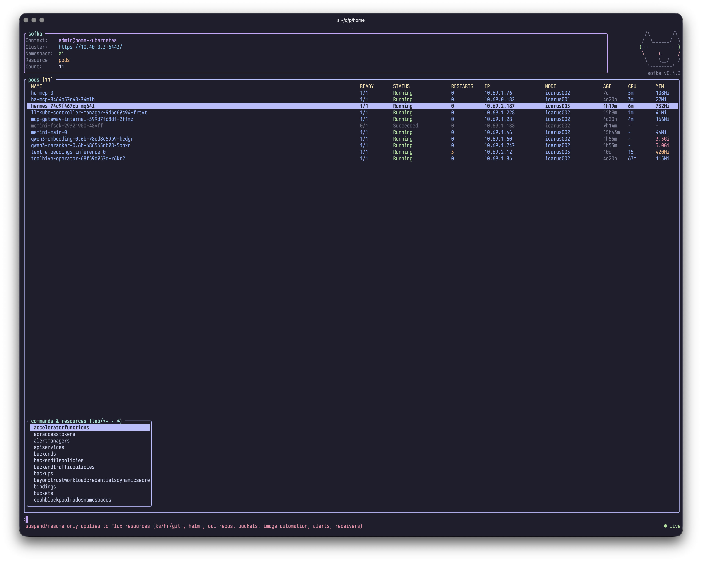
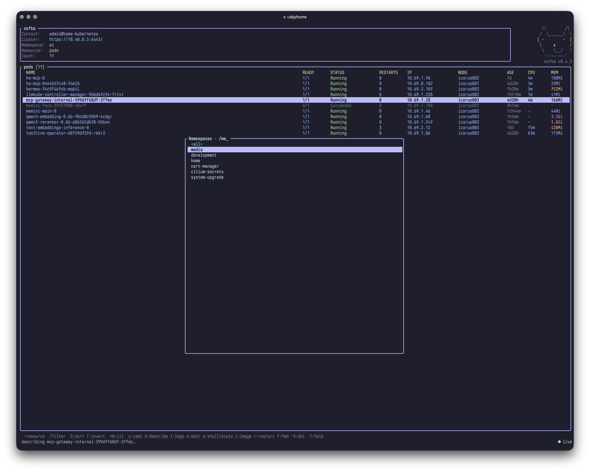
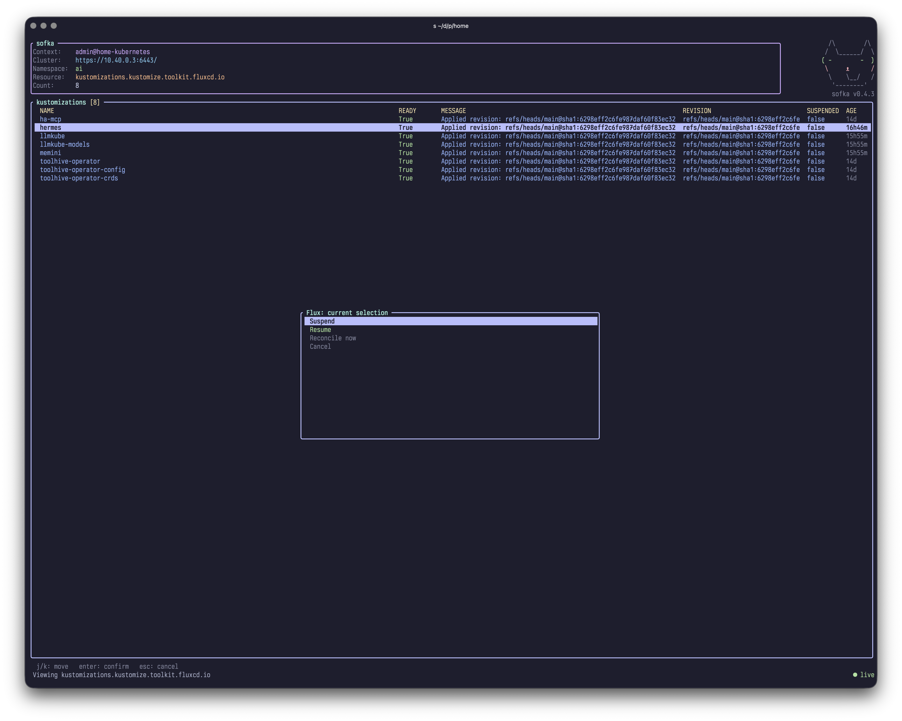

# sofka

A Kubernetes TUI, reimagined in Rust - built on [`kube-rs`](https://kube.rs) and
[`ratatui`](https://ratatui.rs), async-first from the ground up.

## Screenshots

| Pod list + command palette                                                | Namespace switcher                                                          | Flux suspend/resume/reconcile menu                                                      |
| ------------------------------------------------------------------------- | --------------------------------------------------------------------------- | --------------------------------------------------------------------------------------- |
|  |  |  |

### Why "sofka"


That's Sophie. She sits behind the monitor and watches it - not occasionally,
_constantly_, with the specific narrowed-eye expression of someone who has
noticed a pod in `CrashLoopBackOff` and is judging you for it. She doesn't
miss a state change. She doesn't get distracted. She is, functionally, a
cluster watchman who happens to be a cat.

`sofka` is the Serbian diminutive of Sophia - "wisdom," fittingly, since
watching things closely and knowing when something's wrong is more or less
the whole job description of both a good cluster TUI and a good cat.

This is a from-scratch reimagining of [k9s](https://github.com/derailed/k9s)
(originally ~51k lines of Go), not a line-for-line port. It keeps the spirit -
a fast, keyboard-driven cluster navigator - but rethinks the architecture
around a single generic object pipeline instead of one hand-written renderer
per resource kind.

## How it differs from k9s

- **One generic render pipeline, not one file per kind.** k9s ships a
  dedicated Go file (struct + `ColorerFunc`) per resource type it knows about.
  sofka has one `DynamicObject → cells` function with curated columns for the
  common kinds and a NAME/AGE fallback for everything else - so a CRD nobody's
  written a renderer for still lists, sorts, and filters correctly on day one.
- **Flux CD is a first-class citizen, not a plugin.** `t` opens a
  Suspend/Resume/Reconcile-now menu for Kustomizations, HelmReleases,
  git/helm/oci repositories, buckets, image automation, and notification
  alerts/receivers - patching `spec.suspend` and the
  `reconcile.fluxcd.io/requestedAt` annotation directly via the k8s API. No
  `flux` binary required, and it composes with bulk multiselect.
- **Port-forwards run in the background.** Starting one doesn't freeze the
  TUI for its whole lifetime; `:pf` lists active forwards and stops them
  individually while others keep running. They're killed automatically on
  quit rather than left orphaned.
- **Bulk actions via multiselect.** `space` marks rows for delete, kill, or
  Flux suspend/resume/reconcile across many resources at once - not
  one-row-at-a-time.
- **CRD rows drill into their custom resources**, not their YAML - `enter` on
  a CustomResourceDefinition resolves its served version and lists the actual
  objects.
- **Skins, not a single fixed palette.** Built-in Catppuccin, Gruvbox,
  Solarized, Nord, Dracula, Tokyo Night, One Dark, Rosé Pine, and Monokai
  palettes selectable in config, with per-swatch hex overrides. Auto-detects
  a light or dark terminal background when no skin is configured. Every
  semantic color (row status, severity badges, headers, borders) is derived
  from the active palette, so a skin change is consistent everywhere at once.
  Opt into `background = true` to paint the skin's own background instead of
  the terminal's — pair it with a light per-context skin to make prod glow.
- **A combined row colorer.** Whole-row status tinting like k9s (healthy
  rows, errors, pending, completed all read as one color), _plus_ a
  distinct STATUS badge and outlier coloring on RESTARTS/CPU/MEM so a
  crash-looping or resource-hungry pod still pops out of an otherwise
  uniform row.

## Why it's faster

Not a marketing number - these are specific, checkable design choices:

- **No GC.** Rust's ownership model means zero garbage-collector pauses.
  Watching thousands of pods/CRs across a large cluster grows the in-memory
  store, but redraw latency doesn't get jittery as that store grows the way a
  GC'd runtime's can under sustained allocation pressure.
- **Batched redraws.** The event loop drains every pending watch message
  before triggering one redraw (`while let Ok(m) = rx.try_recv()`). A rollout
  touching 50 pods costs one render pass, not fifty.
- **Cached row computation.** Sorting and fuzzy-filtering the visible rows
  only reruns when the underlying data or the filter text actually changed (a
  dirty-flag-guarded cache), not on every frame or every keystroke against the
  full object set.
- **No subprocess overhead for the hot paths.** Delete, scale, suspend/
  resume/reconcile, and CRD drill-down are direct kube API calls (JSON
  merge-patches over the existing client), not a `kubectl`/`flux` process
  fork+exec per action.
- **Generation-tagged streams.** Switching views doesn't wait for an old
  watcher to tear down - stale messages are dropped by generation tag the
  instant a newer watch takes over, so navigation never stalls behind a
  slow-to-cancel stream.

## Features

- **Connect** to the current kubeconfig context, including exec credential
  plugins (e.g. GKE).
- **API discovery** of every resource type on the cluster, with k9s-style
  short aliases (`po`, `dp`, `svc`, `no`, `cm`, `sts`, `ds`, `ks`, `hr`, …) and
  correct precedence (core `pods` beats `pods.metrics.k8s.io`).
- **Live watch** of any kind via `kube::runtime::watcher`, streamed into an
  in-memory store.
- **Curated columns** for common kinds (pods, deployments, replicasets,
  statefulsets, daemonsets, services, nodes, namespaces, configmaps, secrets,
  jobs, cronjobs, PVC/PV, ingresses, endpoints, CustomResourceDefinitions)
  with a NAME/AGE fallback for everything else.
- **Custom views** - user-defined columns for any resource in config
  (`[views]`), extracted via JSON Pointer with typed sorting (quantities,
  numbers, timestamps sort by value). Unknown custom resources automatically
  pick up their CRD's `additionalPrinterColumns`. `w` toggles wide-only
  columns (kubectl `-o wide`).
- **Live CPU/MEM columns** for pods and nodes from the metrics API, with
  outlier coloring. The pod container picker also shows per-container CPU and
  memory, each container's usage as a percentage of its request and limit
  (`-` marks an unset request/limit), and the pod's QoS class; all of it
  degrades gracefully when metrics-server is absent.
- **Drill-down navigation** with a breadcrumb stack: workload/service →
  pods, node → its pods, pod → containers, namespace → re-scope, CRD → its
  custom resources. `esc` pops back.
- **Command palette** (`:`) - fuzzy over the full resource catalog _and_
  built-in commands (`ctx`, `pulse`, `xray`, `diff`, `events`, `pf`) together, plus
  row **filtering** (`/`) with matched-character highlighting: fuzzy text,
  `!text` inverse match, `-l`/`-f` label & field selectors (evaluated by the
  API server on ⏎), and typed column comparisons (`status=CrashLoopBackOff`,
  `cpu>500m`, `memory>1Gi`, `restarts>=5`, `age<2h`) — space-separated terms
  AND together.
- **Multiselect** (`space`) for bulk delete/kill/suspend/resume/reconcile.
- **Pulse dashboard** (`:pulse`) - cluster-health tiles, refreshed every 5s.
- **Xray tree** (`:xray`) - hierarchical view from the current kind down
  through owner references to pods and containers.
- **Flux CD controls** (`t`) - suspend/resume/reconcile menu, native k8s API
  patches.
- **Background port-forwards** (`f`/`F` to start, `:pf` to manage).
- **Plugins** - config-defined shell-out commands bound to keys, scoped per
  resource.
- **Diff** (`:diff`) - unified diff of the live object vs its
  `last-applied-configuration`.
- **Events** (`:events` / `E`) - live Kubernetes Events for the selected
  object, filtered by UID when available.
- **RBAC-aware palette** - hides resource kinds you can't `list`.
- **Namespace switcher** (`n`) and **context switcher** (`:ctx`).
- **YAML view** (`y`) and **describe** (`d`, via `kubectl`).
- **Logs** (`l`) - per-container on a pod, aggregated across all matching
  pods on a workload/service. In-logs **search** (`/`) with highlighting;
  `p` for previous-container logs. ANSI color codes from the source app are
  parsed and mapped onto the active skin, not printed as literal escapes.
- **Skinnable** - built-in Catppuccin, Gruvbox, Solarized, Nord, Dracula,
  Tokyo Night, One Dark, Rosé Pine, and Monokai palettes, auto-detected
  dark/light default, plus per-swatch overrides in config.
- **Config file** (TOML): aliases, default namespace/resource, plugins,
  views, skin.

## Installation

### Download from Github

Prebuilt binaries for macOS (aarch64/x86_64) and Linux (aarch64/x86_64) are
attached to each [GitHub release](https://github.com/nklmilojevic/sofka/releases).

### Nix

Nix users can run it directly without installing anything:

```sh
nix run github:nklmilojevic/sofka
```

### Cargo

```sh
cargo install sofka
```

or build from source (see [Development](#development)).

### macOS: "cannot be opened because the developer cannot be verified"

The release binaries aren't signed/notarized yet, so if you download a
tarball through a browser and extract it, Gatekeeper will refuse to run it -
this is expected, not a broken build. Clear the quarantine flag once:

```
xattr -d com.apple.quarantine sofka
```

(or right-click the binary in Finder → Open, and confirm through the dialog
once). **Signing and notarization are planned for the next release**, at
which point this step won't be necessary.

## Configuration

`$XDG_CONFIG_HOME/sofka/config.toml` (or `~/.config/sofka/config.toml`):

```toml
default_namespace = "kube-system"
default_resource  = "deployments"
readonly          = false  # true disables every mutating action (delete, edit,
                           # scale, shell, plugins, …); --readonly/--write win

[aliases]
dep = "deployments"

[skin]
# name omitted: auto-detects dark/light and picks catppuccin-mocha/-latte.
# Or pick one explicitly: catppuccin-mocha, -latte, -frappe, -macchiato,
# gruvbox-dark, gruvbox-light, nord, dracula, solarized-dark, solarized-light,
# tokyo-night, one-dark, rose-pine, monokai.
name = "gruvbox-dark"
background = true        # fill views with the skin's own background swatch
                        # (default: false = inherit the terminal background)

[skin.colors]            # optional per-swatch overrides
red = "#fb4934"

[[plugins]]
key = "g"
name = "argocd-sync"
command = "argocd"
args = ["app", "sync", "$NAME"]
scopes = ["deployments"]   # omit for all resources
```

### Custom views

Define table columns for any resource — most usefully for custom resources
that would otherwise fall back to NAME/AGE. Views are keyed by
apiVersion/plural (`"cert-manager.io/v1/certificates"`, `"v1/pods"`),
group/plural, bare plural, or lowercased kind; the most specific key wins.

```toml
[views."cert-manager.io/v1/certificates"]
sort = "EXPIRES:desc"     # initial sort column, ":asc" (default) or ":desc"
# replace = true          # replace the curated columns instead of overlaying

[[views."cert-manager.io/v1/certificates".columns]]
name = "READY"
path = "/status/conditions/0/status"
type = "status"           # colors the row like other status columns

[[views."cert-manager.io/v1/certificates".columns]]
name = "EXPIRES"
path = "/status/notAfter"
type = "time"             # rendered as elapsed ("3d4h") / "in 30d"

[[views."cert-manager.io/v1/certificates".columns]]
name = "ISSUER"
path = "/spec/issuerRef/name"
wide = true               # only shown in wide mode (`w`)
```

`path` is a JSON Pointer (RFC 6901) into the object as served by the API —
`/metadata/…`, `/spec/…`, `/status/…`, array indices like
`/status/conditions/0/status`. Column `type` is `text` (default), `status`,
`number`, `quantity` (`500m`, `1Gi`), or `time`; typed columns sort by value,
not lexically. Optional `width` (fixed columns) and `align`
(`left`/`center`/`right`) tune the layout. By default columns overlay the
curated ones: a matching header replaces it in place, new columns land before
AGE. Invalid entries are skipped with a warning shown in-app — they never
take the TUI down.

Custom resources without an explicit view automatically use their CRD's
`additionalPrinterColumns` (columns with `priority > 0` become wide-only),
so most CRs get useful columns with zero configuration.

### Per-cluster / per-context overrides

Any option can be overridden for a specific cluster or kubeconfig context,
k9s-style. Drop partial config files under `clusters/`:

```
~/.config/sofka/
├── config.toml                # base, applies everywhere
└── clusters/
    └── prod-cluster/          # kubeconfig *cluster* name
        ├── config.toml        # every context on prod-cluster
        └── prod-admin/        # kubeconfig *context* name
            └── config.toml    # that context only
```

Overrides merge over the base config (cluster level first, then context
level): tables like `[aliases]` and `[skin.colors]` merge key-by-key,
everything else — strings, booleans, arrays like `[[plugins]]` — replaces the
base value. Directory names are the kubeconfig names with any character other
than letters, digits, `.`, `_`, `-` replaced by `-`, so an EKS context
`arn:aws:eks:eu-west-1:123456789:cluster/prod` becomes the directory
`arn-aws-eks-eu-west-1-123456789-cluster-prod`.

```toml
# clusters/prod-cluster/config.toml — make prod unmistakable and hands-off
readonly = true

[skin]
name = "catppuccin-latte"
background = true
```

A skin named in an override pins that context's colors; contexts without one
keep the session skin (config `skin.name`, the auto-detected default, or your
last `:skin` choice). Overrides are re-read on every `:ctx` switch, so edits
apply without restarting.

### Headless modes (no TTY required)

```
sofka --check                # connect, run discovery, print a summary, exit
sofka pods --snapshot        # render one frame of a resource view to stdout
sofka dp -A --snapshot       # deployments, all namespaces
```

These double as CI smoke tests.

## Usage

```
sofka [RESOURCE] [-n NAMESPACE] [-A] [--readonly | --write]

  RESOURCE          resource to open (alias/plural/kind), default: pods
  -n, --namespace   namespace to start in
  -A, --all-namespaces
  --readonly        disable every mutating action for the session
  --write           force write mode, overriding any config `readonly`
```

`--readonly`/`--write` pin the mode for the whole session, winning over the
config `readonly` option — including per-cluster/per-context overrides — on
every `:ctx` switch. Without a flag, switching into a context whose config
sets `readonly = true` enables read-only mode (shown as `[read-only]` in the
header) and switching away restores write mode.

### Keys

| Key                       | Action                                                                                                                                |
| ------------------------- | ------------------------------------------------------------------------------------------------------------------------------------- |
| `:<resource>`             | command palette - fuzzy over kinds and built-in commands                                                                              |
| `:<resource> <ns>`        | switch kind and namespace at once (`:deploy social`; `all`/`*` = all namespaces; the namespace tab-completes)                         |
| `[` / `]`                 | view history - back / forward through visited kind+namespace views                                                                    |
| `enter`                   | drill down (workload/svc → pods, node → its pods, pod → containers, ns → re-scope, CRD → its resources)                               |
| `esc`                     | go back / pop the view stack / clear filter / clear marks                                                                             |
| `j`/`k`, `↓`/`↑`, `g`/`G` | navigate                                                                                                                              |
| `S` / `I`                 | cycle sort column / invert sort direction                                                                                             |
| `space`                   | mark/unmark row for bulk actions                                                                                                      |
| `/`                       | filter: fuzzy text · `!inverse` · `-l`/`-f` selectors (server-side on ⏎) · `status=X` `cpu>500m` `age<2h`                             |
| `n` / `0`                 | namespace switcher / all namespaces                                                                                                   |
| `shift-j`                 | jump to owner/controller                                                                                                              |
| `o`                       | show the node hosting the selected pod                                                                                                |
| `ctrl-r`                  | refresh the watch                                                                                                                     |
| `y` / `d` / `E`           | view YAML / describe (`kubectl`) / live events                                                                                        |
| `:ctx` / `:ctx <name>`    | context switcher popup / switch directly (the name tab-completes)                                                                     |
| `:skin`                   | switch the color skin live (`:skin gruvbox-dark` applies directly)                                                                    |
| `l` / `p`                 | logs (workload = all matching pods) / previous-container logs                                                                         |
| `c`                       | copy resource name to clipboard                                                                                                       |
| `e`                       | edit in `$EDITOR` (`kubectl edit`)                                                                                                    |
| `s`                       | shell into pod / scale a workload (context-dependent)                                                                                 |
| `a`                       | attach to pod                                                                                                                         |
| `i`                       | set container image                                                                                                                   |
| `r`                       | rollout restart (workloads) / refresh (elsewhere)                                                                                     |
| `f` / `shift-f`           | port-forward (pods/services) - runs in the background                                                                                 |
| `t`                       | Flux: suspend/resume/reconcile menu                                                                                                   |
| `C` / `U` / `D`           | nodes: cordon / uncordon / drain                                                                                                      |
| `ctrl-d` / `ctrl-k`       | delete / force-delete (marked rows, or current); in confirm: `f` toggles force, `c` cycles cascade (background → foreground → orphan) |
| `:q`, `ctrl-c`            | quit                                                                                                                                  |
| `?`                       | help                                                                                                                                  |

**Logs view:** `/` search+highlight · `s` autoscroll · `w` wrap · `t`
timestamps · `x` stop/resume stream · `c` copy buffer · `ctrl-s` save to file
· `esc` back. The newest line anchors to the bottom of the viewport.

Interactive actions (`e`, `s`-shell, `a`) suspend the TUI and shell out to
`kubectl`; delete/scale/restart/set-image/suspend/resume/reconcile/
port-forward go through the kube API (or a backgrounded process) directly.

## Architecture

```
main.rs      CLI (clap), terminal lifecycle, the async select! event loop,
             and the --check / --snapshot headless modes.
app.rs       All application state + input handling (a mode state machine:
             Table / Command / Filter / Detail / Logs / FluxMenu /
             PortForwards / Help / Namespaces / …). Spawns watch/log/
             port-forward tasks.
k8s.rs       Cluster connect, API discovery, alias registry + group-priority
             resolution, watch-task spawning, namespace listing.
store.rs     In-memory resource store + the Msg enum that watch tasks send to
             the UI (generation-tagged so stale streams are dropped).
columns.rs   Per-kind column definitions and cell extraction from
             DynamicObjects (the "render" layer), with unit tests.
ui.rs        All ratatui rendering: header, table, scrollable views, popups,
             status bar.
theme.rs     Palette + semantic styles, skin resolution.
```

Data flow: `watcher` tasks push generation-tagged `Msg`s over an
`mpsc::UnboundedSender`; the main `tokio::select!` loop folds them into the
`Store`, batches any other queued updates before redrawing, and shares that
same loop with terminal input and a 1s tick (age columns, dead port-forward
reaping) - so the UI never blocks on the network.

## Development

```
cargo run -- pods            # run against current context
cargo test                   # unit tests (no cluster required)
cargo clippy --all-targets   # lints (clean)
```

## Release

After merging the release-ready changes to `main`, run one of:

```
just release-patch
just release-minor
just release-major
```

The recipe switches to a clean, up-to-date `main`, bumps `Cargo.toml` /
`Cargo.lock`, commits and pushes the version bump, then creates the GitHub
Release. The release workflow runs from that published release and uploads
platform binaries, publishes crates.io, and warms the Nix cache.

## License

Dual-licensed under [MIT](LICENSE-MIT) or [Apache-2.0](LICENSE-APACHE), at
your option - the Rust ecosystem standard.
